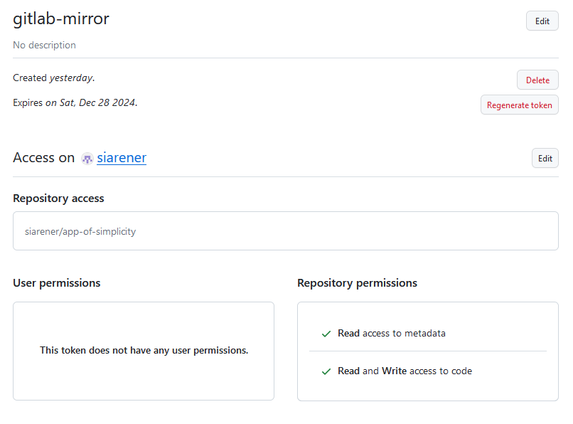
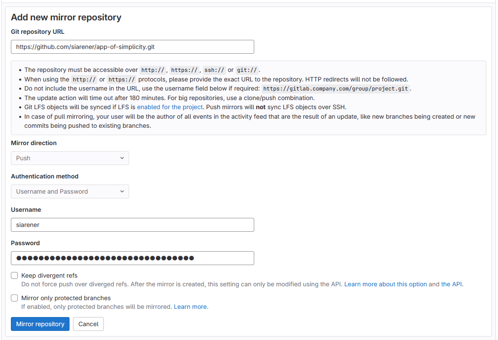

# How to set up a push-mirror from a GitLab to a GitHub repository

I documented the setup here, as the possible configuration in GitLab changed and a lot of instructions found online still refer to the old option.

## Get GitHub Personal Access Token
- go to https://github.com/settings/tokens > `Generate new token`
- add a `Token name`, and set the `Expiration` to something sensible
- below `Repository access`, select `Only select repositories`, and choose the respective repository in the drop-down
- expand the `Repository permissions`, and in `Contents` choose `Access: Read and write`
- click on `Generate token`, and save the generated token to use in the mirror setup in GitLab (instructions in next paragraph)
- if you click on the generated token in you [token list](https://github.com/settings/tokens?type=beta), it should look like this: 
    {width=50%  style="border: 2px solid  gray;"}

## Setup push-mirror in GitLab
- in the GitLab repository, go to `Settings` > `Repository` > `Mirroring repositories`.  
    {width=50%}
